## Setup Instructions 🧑‍💻

- System requirments

    - Python 3.x 🐍
    - Ram: &#x2265; 16 GB
    - Storage: &#x2265; 200 GB
    - OS: Windows 🪟, Linux 🐧

- Required software
    - [Miniconda](https://docs.anaconda.com/free/miniconda/index.html)
    - [Visual Studio Code](https://code.visualstudio.com/)

## Setting up __conda__  

👉 Install __miniconda__ by following the on-screen instructions

❗ __make sure to add miniconda to path__  

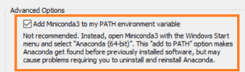

👉 Open Anaconda Prompt  

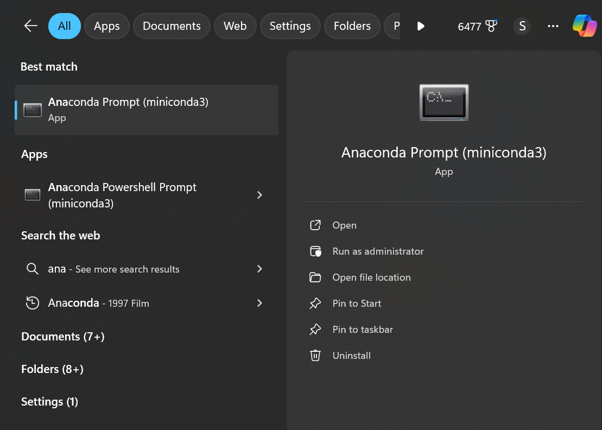 

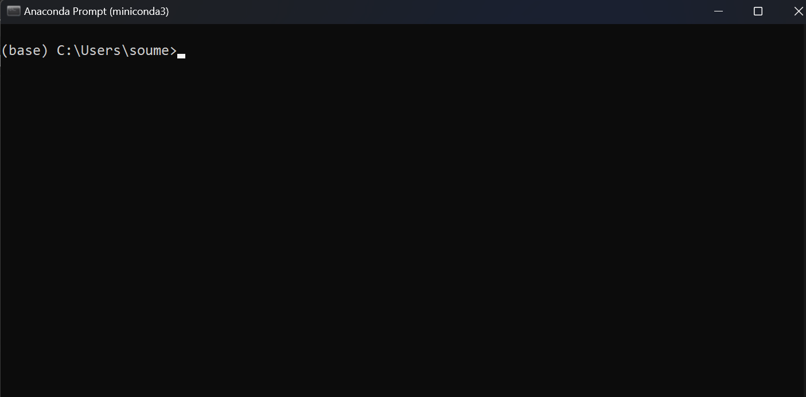  

✅ __Creating a separete python development environment streamline your package management__  

    conda create -n pyenv python=3.11  

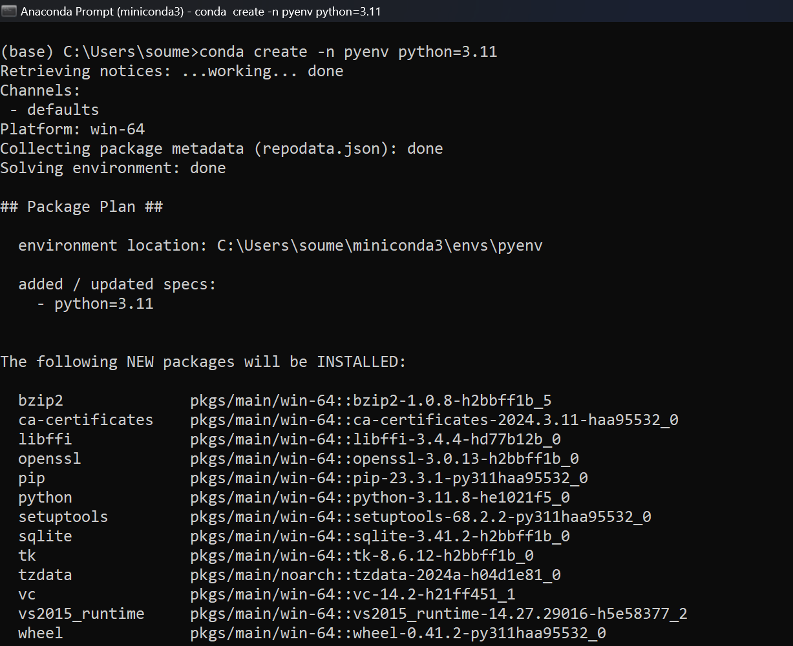  

⌛ wait for some time to finish the intital setup  

👉 after completion, time to activate your conda env 😇  

👉 you can activate conda env: __pyenv__ by using: 

    conda activate pyenv  

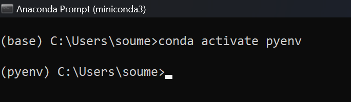  

👉 you can see __(base)__ has changed to __(pyenv)__  

👉 Let's install required packages:  

    conda install numpy pandas matplotlib seaborn jupyter ipykernel

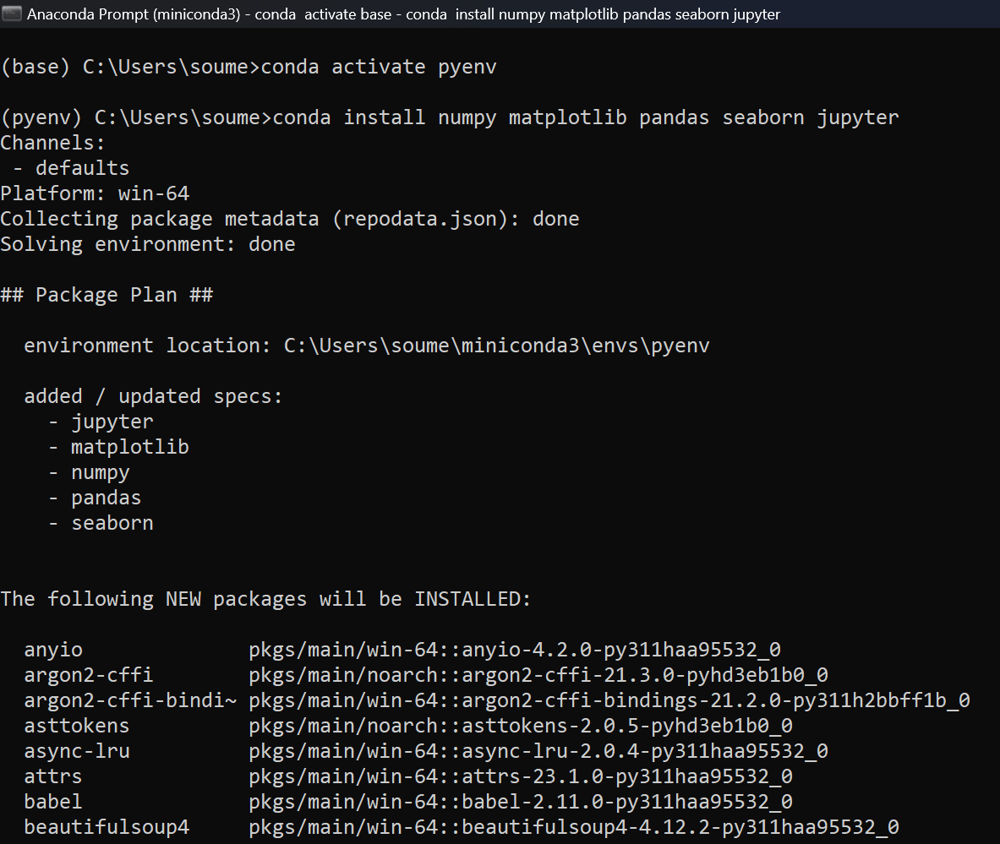  

✅ Proceed with the installation  

🚀 Your conda env: __pyenv__ is ready to use with the requried packages  

⚠️ Make sure to activate __pyenv__ using the command given above before using it.

## Setting up __Visual Studio Code__  

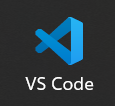

 👉 [Installing Visual Studio Code in Windows 🪟](https://code.visualstudio.com/docs/setup/windows)  

⚠️ For Linux based distributions (Ubuntu) 🐧 

    sudo snap install code --classic  

After installation, we need to install few __extension__ required for working with python. For installing extension in __Visual Studio Code__  

👉 Open VS Code  

👉 Click this icon on the left activity bar to search __Extensions Marketplace__  

Search for __Python__ and install the extension  

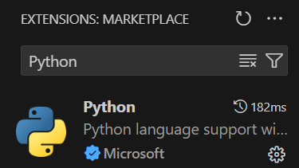  

Search for __Jupyter__ and install the extension  

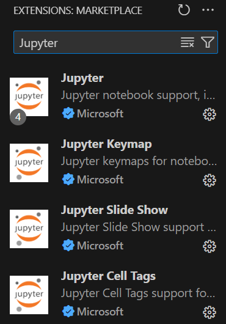  

__Optional Extensions__

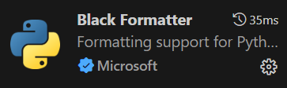

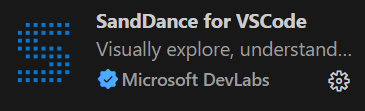

- After installing all the required extensions, let us create __.ipynb()__ file for working with python code

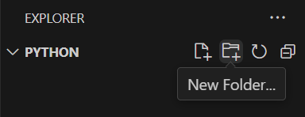

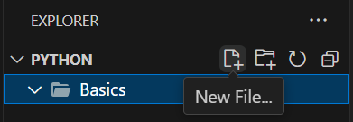

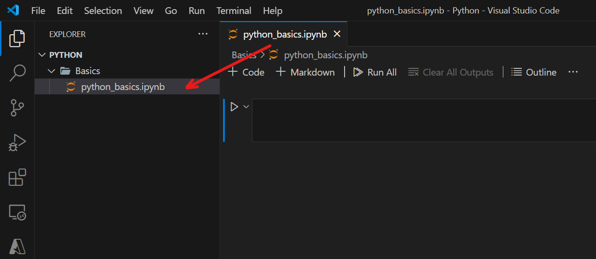  

⚠️ Change __kernel__ to __pyenv__

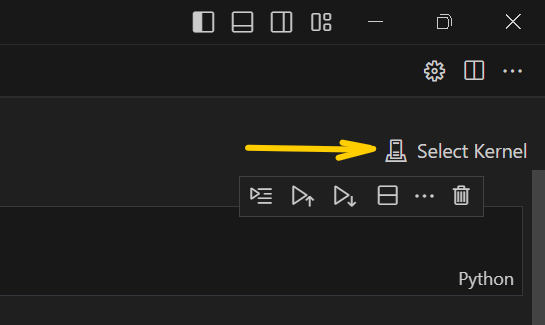  

👉 Choose __pyenv__ from the list

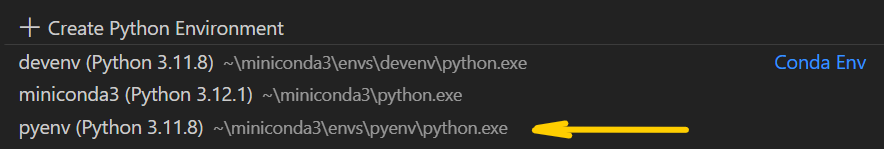  

🚀 There you go, you successfully activated your __conda env__ in VS Code

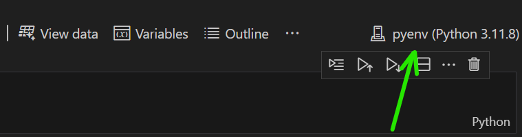  

🧑‍💻 __Let's Test__  

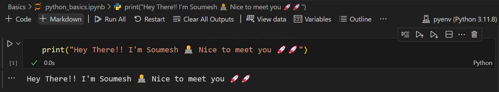

🤘 __It's working ✅✅✅__

If any issue persists, please [Create a New Issue](https://github.com/soumesh2002/Python-Tutorials/issues)  

I'll Surely help 😇  

